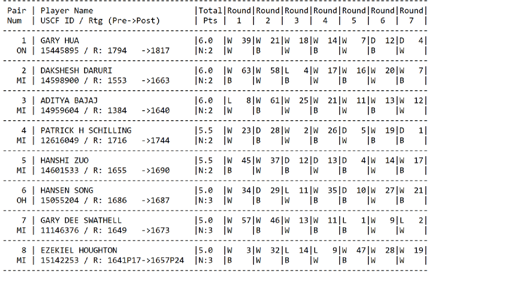

```{r setup, include=FALSE}
knitr::opts_chunk$set(echo = TRUE)
```


### Project Summary:

The project involves processing a text data file which includes the chess tournament results. The file captures the chess rating system (invented by a Minnesota statistician named Arpad Elo) for a player and the opponents he played against in 7 rounds of the tournament. Below is a snippet of the file data structure - 



### Project Goal:

The project goal is to be able write R code to scrape and cleanse the data from the semi-structured text file, calculate average pre-ratings of all the opponenets for a given chess player and then export the tabular data in csv format including below columns -

  - Player's Name
  - Player's State
  - Total Number of Points
  - Player's Pre-Rating
  - Average Pre Chess Rating of Opponents

For the first player in the list, the information would be:
Gary Hua, ON, 6.0, 1794, 1605

### R Libraries:

Load necessary libraries -

```{r message=FALSE, warning=FALSE}
library(tidyverse)
library(kableExtra)
library(stringr)
library(dplyr)
library(reshape2)
```

### Data Processing Steps :

Below are the steps to be followed for extracting, cleansing and processing data to generate the final output -

1.  Import data into R:

```{r}
rawData <- read.delim("https://raw.githubusercontent.com/soumya2g/R-CUNY-MSDS/master/DATA-607/Chess%20Tournament/Source%20Files/TournamentInfo.txt",header = FALSE, stringsAsFactors = FALSE)
head(rawData)
```


2.  Clean the row delimiters present as a series of dash ('-') characters and delete the resultant empty lines:

```{r}
## Clean up the row delimiters
rawData <- data.frame(str_replace_all(rawData$V1,"-",""))
head(rawData)

## Delete empty lines
rawData1 <- data.frame(rawData[!apply(rawData == "",1,all),])
head(rawData1)
```

The data set for each player in the file can be divided between Odd and Even row numbers. So I have separated the processing of the data between Odd and Even records -


3.  Processing of Odd rows:

Odd rownumbers are extracted in a separate data frame and data is split up by the pipe('|') column demiliter.

```{r}
### Odd Rows 
oddRows <- rawData1 %>% dplyr::filter(row_number() %% 2 == 1)
oddRows[] <- lapply(oddRows,as.character)

### Split the data based on pipe delimiters in a list format 

oddList <- lapply(oddRows,  function(X){
  strsplit(X, "\\|")
})

### Remove addiotnal blank column at the end 
v <- oddList[[1]][[1]]
v <- v[-11]
oddList[[1]][[1]] <- v

### Convert the list into a matrix and then a data frame 
oddDf <- data.frame(matrix(unlist(oddList), nrow  = 65, byrow = T))

head(oddDf) %>% kable() %>% kable_styling(bootstrap_options = c("striped", "hover", "condensed", "responsive")) %>% scroll_box(width="100%",height="300px")
```


4.  Processing of Even rows:

```{r}
### Even Rows 

evenRows <- rawData1 %>% dplyr::filter(row_number() %% 2 == 0)
evenRows[] <- lapply(evenRows,as.character)

### Split the data based on pipe delimiters in a list format 

evenList <- lapply(evenRows,  function(X){
  strsplit(X, "\\|")
})

### Remove addiotnal blank column at the end 
v <- evenList[[1]][[1]]
v <- v[-11]
evenList[[1]][[1]] <- v

### Convert the list into a matrix and then a data frame 
evenDf <- data.frame(matrix(unlist(evenList), nrow  = 65, byrow = T))

head(evenDf) %>% kable() %>% kable_styling(bootstrap_options = c("striped", "hover", "condensed", "responsive")) %>% scroll_box(width="100%",height="300px")
```


5. Combine Odd and Even record data frames into a combined flat data frame:

Here after combining the odd and even rows, Players's USCF_ID, Pre and Post Ratings are extracted using regular expressions and un-necessary columns are removed from the data frame.

```{r warning=FALSE}

### Combine Odd and Even records into one data frame 
tournamentTable <- data.frame(cbind(oddDf,evenDf), stringsAsFactors = FALSE)

### Convert the factor into Character for applying Regex exression 
tournamentTable$X2.1 <- as.character(tournamentTable$X2.1)

### Extract USCF_ID, Player's Pre and Post Ratings 
tournamentTable$USCF_ID <- str_extract_all(str_trim(tournamentTable$X2.1),"^(\\d+)")
tournamentTable$Player_Pre_Rating <- as.integer(str_trim(str_extract(str_extract(tournamentTable$X2.1,"[^\\d]\\d{3,4}[^\\d]"),"\\d+")))
tournamentTable$Player_Post_Rating <- as.integer(str_extract(str_extract(tournamentTable$X2.1,"(>\\s*\\d{3,4}[^\\d])"),"\\d+"))

### Strip the 1st row with column names and strip off any unnecessary columns
tournamentTable <- tournamentTable %>% dplyr::filter(row_number() != 1)
tournamentTableFinal <- tournamentTable[-c(12:20)]

### Add header record to the data frame
names(tournamentTableFinal) <- c("Player_No","Player_Name","Total_Points","Round1","Round2","Round3","Round4","Round5","Round6","Round7",
                                 "Player_State","USCF_ID","Player_Pre_Rating","Player_Post_Rating")

tournamentTableFinal %>% kable() %>% kable_styling(bootstrap_options = c("striped", "hover", "condensed", "responsive")) %>% scroll_box(width="100%",height="300px")

```


6.  Create a normalized data frame containing records for each round of the tournament for each of the players including their opponents rating details

```{r warning=FALSE}
### Keeping necessary columns for the Project
playerSummaryDF <- select(tournamentTableFinal, Player_No:Total_Points, Player_State:Player_Post_Rating)

playerSummaryDF %>% kable() %>% kable_styling(bootstrap_options = c("striped", "hover", "condensed", "responsive")) %>% scroll_box(width="100%",height="300px")

#### Create the Normalized data frame including details of each round and opponents ratings details based on a inner join with the base data set 
roundDetailsDF <-  
  tournamentTableFinal %>% select(Player_No, Round1:Round7) %>%
  melt(id.var=c("Player_No"), value.name="Outcome_Opp")  %>% 
  mutate( Round        = as.numeric(str_replace(variable, "Round", "")),
          Result      = str_extract(Outcome_Opp, "^\\w+"),
          Opponent_Player_No = as.numeric(str_extract(Outcome_Opp, "\\d+$"))) %>%
  select(-c(variable, Outcome_Opp)) %>%
  inner_join(select(playerSummaryDF, Player_No, Player_Pre_Rating), c("Opponent_Player_No" = "Player_No")) %>%
  select(Player_No, Round, Result, Opponent_Player_No, Player_Pre_Rating) %>%
  arrange(Player_No, Round)

### Rename Palyer_Pre_Rating to Opponent_Pre_Rating 
names(roundDetailsDF)[names(roundDetailsDF) == "Player_Pre_Rating"] <- "Opponent_Pre_Rating"

roundDetailsDF %>% kable() %>% kable_styling(bootstrap_options = c("striped", "hover", "condensed", "responsive")) %>% scroll_box(width="100%",height="300px")

```


7. Calculate the Average Pre-rating of the opponents for each of the chess players:

```{r warning=FALSE}

### Calculate Mean/Average Pre-Rating of Opponenets for each player 

playerSummaryDF <-  
  roundDetailsDF %>%
  group_by(Player_No) %>% summarise(Opponents_Avg_Pre_Rating = round(mean(Opponent_Pre_Rating))) %>%
  inner_join(playerSummaryDF, by="Player_No") %>%
  select(Player_Name, Player_State, Total_Points, Player_Pre_Rating, Opponents_Avg_Pre_Rating)

playerSummaryDF %>% kable() %>% kable_styling(bootstrap_options = c("striped", "hover", "condensed", "responsive")) %>% scroll_box(width="100%",height="300px")

```


8.  Export the data into csv format:

```{r}

### Final Output to csv file

write.csv(playerSummaryDF, "Chess_Players_Summary.csv",row.names = FALSE)
```
