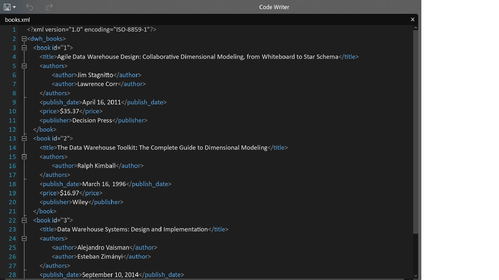

```{r setup, include=FALSE}
knitr::opts_chunk$set(echo = TRUE)
```


### Assignment Summary:

Below is the summary of the assignment - 


### R Libraries:

Load necessary libraries -

```{r message=FALSE, warning=FALSE}
library(kableExtra)
library(stringr)
library(plyr)
library(XML)
#library(RJSONIO)
library(jsonlite)
library(rvest)

```

### 1. Source Files (.html, .xml & .json) Creation :

Below are the steps to be followed to generate the final output -

1.  I created the following files by hand containing the details of my favourite Data Warehouse books:

### 1.1.  books.html:


### 1.2.  books.xml



### 1.3.  books.json


### 2. Data import from Files :

2.  Import data into R:

### 2.1 HTML File:

```{r}
#Reading in the HTML Code
htmlURL <- "C:\\CUNY\\Semester1 (Fall)\\DATA 607\\Week7 Assignment\\Source Files\\books.html"

#Parsing the Code using htmlParse
parsedHTML <- htmlParse(file = htmlURL)
parsedHTML

```

### 2.2 XML File:

```{r}
#Reading in the XML Code
xmlURL <- "C:\\CUNY\\Semester1 (Fall)\\DATA 607\\Week7 Assignment\\Source Files\\books.xml"

#Parsing the Code using xmlParse
parsedXML <- xmlParse(file = xmlURL)
parsedXML

```

### 2.3 JSON File:

```{r}
#Reading in the JSON Code
jsonURL <- "C:\\CUNY\\Semester1 (Fall)\\DATA 607\\Week7 Assignment\\Source Files\\books.json"

#Parsing the Code using fromJSON
parsedJSON <- fromJSON(jsonURL)
parsedJSON
```

### 3. Parsing data and loading into data frames :

3.  Load parsed source files into R data frames:

### 3.1 HTML File:

```{r}

### rvest Method ####
#Reading in the HTML Code
htmlURL <- read_html("C:\\CUNY\\Semester1 (Fall)\\DATA 607\\Week7 Assignment\\Source Files\\books.html")

print(htmlURL)

tables <- html_nodes(htmlURL,"table")
tables_ls <- html_table(tables, fill = TRUE)
tableDF <- as.data.frame(tables_ls)


head(tableDF) %>% kable() %>% kable_styling(bootstrap_options = c("striped", "hover", "condensed", "responsive")) %>% scroll_box(width="100%",height="300px")
```


### 3.2 XML File:

```{r}
#Extract XML file's root
root <- xmlRoot(parsedXML)

#Loading into Data Frame
booksXMLDF <- xmlToDataFrame(root)

head(booksXMLDF) %>% kable() %>% kable_styling(bootstrap_options = c("striped", "hover", "condensed", "responsive")) %>% scroll_box(width="100%",height="300px")

```

I had to extract the 'id' attribute of the 'book' tag as part of the data frame. Also, for the books with multiple authors, the values from the child tag 'author' have been concatenated. I have converted those concatenated strings into comma separated values.

```{r}

### Create commas separated list for books with multiple authors
authorsList <- unlist(lapply((xpathSApply(parsedXML,"//authors",fun=xmlToList)), function(X){
  paste(unlist(X), collapse = ", ")
} ))

booksXMLDF$authors <- authorsList

### Extract 'id' Tag attribute
ids <- as.data.frame(xmlSApply(root, xmlGetAttr, "id"))
names(ids) <- "book#"

### Merge using cbind
booksXMLDF <- cbind(ids, booksXMLDF)

head(booksXMLDF) %>% kable() %>% kable_styling(bootstrap_options = c("striped", "hover", "condensed", "responsive")) %>% scroll_box(width="100%",height="300px")

```

### 3.3 JSON File:

```{r}
#Parsing the Code using fromJSON
booksJSONDF <- parsedJSON$dwh_books
booksJSONDF <- as.data.frame(booksJSONDF)

head(booksJSONDF) %>% kable() %>% kable_styling(bootstrap_options = c("striped", "hover", "condensed", "responsive")) %>% scroll_box(width="100%",height="300px")

```

Converted the Character vector created for books with muliple authors into comma seprated list :

```{r}
authorsList <- unlist(lapply(booksJSONDF$authors, function(X){
  paste(unlist(X), collapse = ", ")
} ))

booksJSONDF$authors <- authorsList

head(booksJSONDF) %>% kable() %>% kable_styling(bootstrap_options = c("striped", "hover", "condensed", "responsive")) %>% scroll_box(width="100%",height="300px")

```

### Conclusion:

The three data frames generated from the .html, ,xml and .json files are identical.