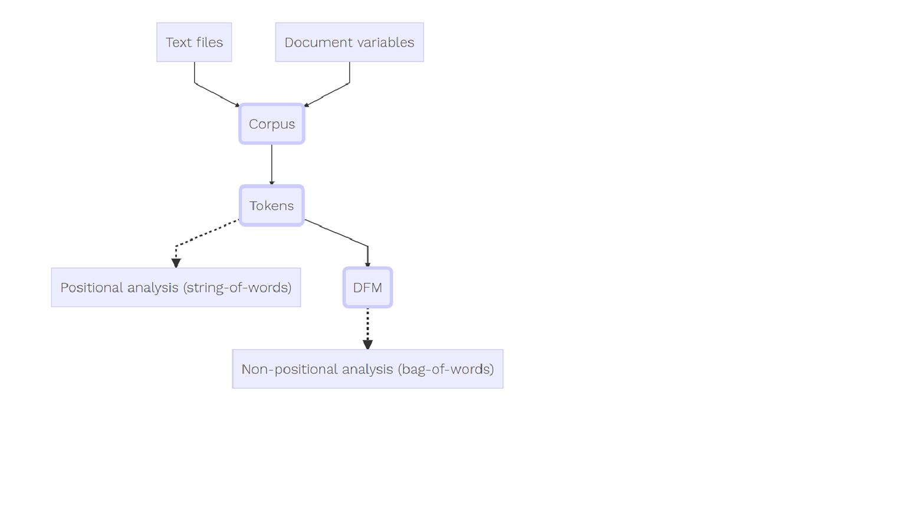

```{r setup, include=FALSE}
knitr::opts_chunk$set(echo = TRUE)
```


### Project Summary:

This project is to build a Supervised Learning techniques based document classification model to detect Spam Vs. Ham e-mail documents. Training and Test data has been obtained based on the public data sets available under below location -

https://spamassassin.apache.org/old/publiccorpus/

### GitHub Location:

https://github.com/soumya2g/R-CUNY-MSDS/tree/master/DATA-607/E-mail%20Spam%20Detection%20Model

### R Libraries:

Load necessary libraries -

```{r message=FALSE, warning=FALSE}
library(kableExtra)
library(dplyr)
library(tm)
library(stringr)
library(ggplot2)
library(rvest)
library(R.utils)
library(quanteda)
library(readtext)

```

### Project Goal :

The goal of this project is to build a supervised document classification solution to work with the already labelled Training data sets (Spam Vs. Ham) and build corpus of documents, extract tokens, build a document feature matrix following a structured workflow approach as depicted below -



### Wrapper functions :

I have tried to modularise the solution using few wrapper functions-

 - downloadTAR() : The purpose of this function is to read a set of input zipped files and a file type label for 'Spam' or 'Ham' and extract the raw text files into appropriate Training data directory and return a data frame containing the listing of files for a specific label (Spam or Ham).
 
 - buildCorpus() : This function receives the file type label and the dataframe containing the list of training data files. It reads all these files from appropriate training data directory and parses each of the files to build a corpus of documents including document level variables like e-mail sender address, subject line etc.

**Note:** I have used rvest package to read the e-mail documents body section based on HTML Tags. While using this library there were quite a few documents which threw errors for which I had to create a list of error files and exclude them in my Training data build process.  

```{r message=FALSE, warning=FALSE}
### Function to download all Spam and Ham Files 

downloadTAR <- function(filetype=NULL, url=NULL, rootfile=NULL){
  
  directoryReplace <- str_sub(rootfile,10,str_locate(rootfile,"\\.")[1,1]-1)
 
  myfile <- paste(url,rootfile,sep="")

  destfile <- paste(filetype,".tar.bz2", sep="")
    
  download.file(myfile, destfile= destfile)
    
  destTarFile <- paste(filetype,".tar", sep="")
  bunzip2(destfile,destname=destTarFile, overwrite=TRUE, remove=TRUE)
  untar(destTarFile,exdir = paste(getwd(),"/",filetype,sep = ""))

  filenamesDF <- data_frame(filetype,filename = str_trim(str_sub(untar(destTarFile, list = TRUE),nchar(directoryReplace)+2,-1)))

  return(filenamesDF)
}

### Function to build corpus

buildCorpus <- function(importtype=NULL, filenames=NULL){

  if (importtype == "Spam") {
    filePaths <- paste(getwd(),"/",importtype,"/",importtype,"/",filenames$filename, sep = "")
  }
  if (importtype == "Ham") {
    filePaths <- paste(getwd(),"/",importtype,"/easy_ham/",filenames$filename, sep = "")
  }

  tempEmailBody <- vector()
  tempEmailFrom <- vector()
  tempEmailSubject <- vector()
  docid <- vector()

  for(i in 1:length(filenames$filename)){
    if(filenames$filename[i] != "cmds" & nchar(filenames$filename[i])>10 & filenames$filename[i] != "0000.7b1b73cf36cf9dbc3d64e3f2ee2b91f1" &
       filenames$filename[i] != "0143.260a940290dcb61f9327b224a368d4af" & filenames$filename[i] != "00136.faa39d8e816c70f23b4bb8758d8a74f0" &
       filenames$filename[i] != "0231.7c6cc716ce3f3bfad7130dd3c8d7b072" & filenames$filename[i] != "0250.7c6cc716ce3f3bfad7130dd3c8d7b072")
    {
      con <- file(filePaths[i], open="rt")
      text <- readLines(con)
      if(length(text) > 1)
      {
        msg <- text[seq(which(text == "")[1] + 1, length(text), 1)]
        eMailBodyDoc <- msg
        emailSubject <- str_trim(str_replace_all(str_sub(unlist(str_extract_all(eMailBodyDoc,"Subject:.*")),10,-1),"  ",""))
        emailFrom <- str_trim(str_sub(unlist(str_extract_all(eMailBodyDoc,"From:.*")),7,-1))
        eMailBodyDoc <- eMailBodyDoc %>% str_replace_all("\n","") 
        eMailBodyDoc <- eMailBodyDoc %>% str_replace_all("<.*>","") 
      
        tempEmailBody[i] <- ifelse(length(eMailBodyDoc) == 0,"Body not available",eMailBodyDoc)
        tempEmailFrom[i] <- ifelse(length(emailFrom) == 0,"Sender not available",emailFrom)
        tempEmailSubject[i] <- ifelse(length(emailSubject) == 0,"Subject not available",emailSubject)
        docid[i] <- ifelse(nchar(filenames$filename[i]) == 0,"E-mail name not available",filenames$filename[i])
      }
      close(con)
    }

  }
  email_corp <- corpus(tempEmailBody, docvars = data_frame(Email_From = tempEmailFrom, Email_Subject = tempEmailSubject, Tag = importtype)) 
  email_corp <- corpus_subset(email_corp,!is.na(Email_From))
  docid <- docid[ifelse(!is.na(docid), TRUE,FALSE)]
  docnames(email_corp) <- docid 
  
  return(email_corp)
}

```
### Training Data Preparation :

The 9 folders available in the source were decompressed and copied into two folders, one containing the "ham" and the other containing the "spam". I found out that there were some duplicated files in the original raw dataset. After removing the duplicates, I obtained 6,952 ham and 2,398 spam files, for a total of 9350 files.

1.  Document Loading  :

I downloaded the training data files from the source and extracted them under appropriate local source directories using the wrapper function downloadTAR()

```{r message=FALSE, warning=FALSE}
URL <- "https://spamassassin.apache.org/old/publiccorpus/"

spamFiles <- c("20021010_spam.tar.bz2","20030228_spam.tar.bz2","20030228_spam_2.tar.bz2")

hamFiles <- c("20021010_easy_ham.tar.bz2","20021010_hard_ham.tar.bz2","20030228_easy_ham.tar.bz2",
              "20030228_easy_ham_2.tar.bz2")

### Set Local Working directory
#setwd("C:/CUNY/Semester1 (Fall)/DATA 607/Project 4/Source/Training Data")

```

2.  Extract all the Spam Files from source :

```{r message=FALSE, warning=FALSE}
## Extract all the Spam Files under Training Data

spamFileNames <- data_frame()

for(i in 1:length(spamFiles))
{
  spamFileNames <- rbind(spamFileNames,downloadTAR("Spam", URL, spamFiles[i]))
}

spamTrainCount <- spamFileNames %>% group_by(filetype) %>% summarise(file_count = n())

```

3.  Extract all the Ham Files from source :

```{r message=FALSE, warning=FALSE}
## Extract all the Ham Files under Training Data

hamFileNames <- data_frame()

for(i in 1:length(hamFiles))
{
  hamFileNames <- rbind(hamFileNames,downloadTAR("Ham", URL, hamFiles[i]))
}

hamTrainCount <- hamFileNames %>% group_by(filetype) %>% summarise(file_count = n())

#### Training Data Summary

rbind(spamTrainCount,hamTrainCount) %>% kable() %>% kable_styling(bootstrap_options = c("striped", "hover", "condensed", "responsive")) %>% scroll_box(width="100%",height="300px")

```

### Build Document Corpuses:

4.  Build Document Corpuses using Training Data set :

```{r message=FALSE, warning=FALSE}
#### Build Spam Corpus and Summarise

spamEmailCorp <- buildCorpus(importtype = "Spam", filenames = spamFileNames)
summary(spamEmailCorp) %>% kable() %>% kable_styling(bootstrap_options = c("striped", "hover", "condensed", "responsive")) %>% scroll_box(width="100%",height="300px")

#### Build Ham Corpus and Summarise

hamEmailCorp <- buildCorpus(importtype = "Ham", filenames = hamFileNames)
summary(hamEmailCorp) %>% kable() %>% kable_styling(bootstrap_options = c("striped", "hover", "condensed", "responsive")) %>% scroll_box(width="100%",height="300px")
```

### Apply Tokenization :

5.  Tokenize the Spam and Ham Corpuses :

While tokenizing the corpuses using Quanteda's tokens() function, I have removed the numbers and punctuation symbols.

```{r message=FALSE, warning=FALSE}
### Spam Tokens
spamTokens <- tokens(spamEmailCorp,remove_punct = TRUE,remove_numbers = TRUE)
head(spamTokens) 

### Ham Token
hamTokens <- tokens(hamEmailCorp,remove_punct = TRUE,remove_numbers = TRUE)
head(hamTokens) 

```

6.  Sample context based search on Tokens :

```{r message=FALSE, warning=FALSE}
### Keyword in Context based search for "Spam"

kwic(spamEmailCorp, "spam", valuetype = "regex") %>% kable() %>% kable_styling(bootstrap_options = c("striped", "hover", "condensed", "responsive")) %>% scroll_box(width="100%",height="300px")

```

### Build Document Feature Matrix :

7.  Build Document Feature Matrix :

In order to perform statistical analysis such as document scaling, we must extract a matrix associating values for certain features with each document. I have used quanteda library's dfm function to produce such a matrix. "dfm" is short for document-feature matrix, and always refers to documents in rows and "features" as columns. We fix this dimensional orientation because it is standard in data analysis to have a unit of analysis as a row, and features or variables pertaining to each unit as columns. We call them "features" rather than terms, because features are more general than terms: they can be defined as raw terms, stemmed terms, the parts of speech of terms, terms after stopwords have been removed, or a dictionary class to which a term belongs. 

```{r message=FALSE, warning=FALSE}
### Document Feature Matrix: Spam

spamDFM <- dfm(spamEmailCorp, remove = stopwords("english"), stem = TRUE, remove_punct = TRUE, remove_numbers = TRUE)

spamDFM <- dfm_trim(spamDFM, min_termfreq = 4, max_docfreq = 10)

head(spamDFM)

topfeatures(spamDFM,20)

### Document Feature Matrix: Ham

hamDFM <- dfm(hamEmailCorp, remove = stopwords("english"), stem = TRUE, remove_punct = TRUE, remove_numbers = TRUE)

hamDFM <- dfm_trim(hamDFM, min_termfreq = 4, max_docfreq = 10)

head(hamDFM)

topfeatures(hamDFM,20) 
```

### Wordcloud Visualization :

8.  Build Wordclouds to identify top occurring tokens in Spam and Ham data sets :

```{r message=FALSE, warning=FALSE}
### Spam Wordcloud
set.seed(100)
textplot_wordcloud(spamDFM, min_count = 6, random_order = FALSE,
                   rotation = .25, 
                   color = RColorBrewer::brewer.pal(8,"Dark2"))

### Ham Wordcloud
set.seed(100)
textplot_wordcloud(hamDFM, min_count = 6, random_order = FALSE,
                   rotation = .25, 
                   color = RColorBrewer::brewer.pal(8,"Dark2"))
```


