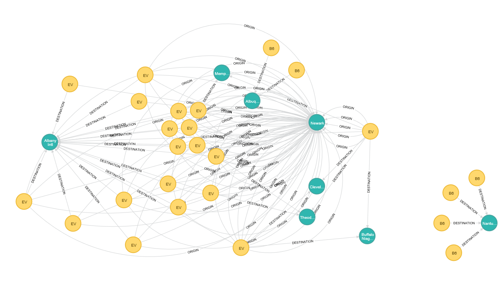

```{r setup, include=FALSE}
knitr::opts_chunk$set(echo = TRUE)
```

### Assignment Description: 
The purpose of this assignment is to migrate a MySQL relational database into a NoSQL database platform. I have chosen 'Flights' database as a source and Neo4j graph database as a target NoSQL DB platform.

### Assignment Goal: 
The purpose of this DB platform migration is to be able to capture relationships between various entities graphically and ability to easily answer critical questions based on the property graph created in graph database.

### MySQL Database Tables:

#### This migration process involves following tables in the 'flights' source database -
#### 1. flights
#### 2. airlines
#### 3. airports
#### 4. planes
#### 5. weather

**Note:** MySQL database software need to be installed in the local computer in order to successfully execute the R markdown code.

### R Libraries:

Load necessary libraries -
```{r message=FALSE, warning=FALSE}
library(RODBC)
library(dplyr)
library(stringr)
library(kableExtra)
library(data.table)
```

Below are the steps followed to perform database migration -

1. Establish MySQL DB Connection:

I have used RODBC package and an ODBC data source called 'MySQL_Flights' in order to connect to the database and retrieve tables into respective data frames.

```{r}
con <- odbcConnect("MySQL_Flights")
```

### Data Sets:

#### A. Flights:

```{r}
flights_df <- as.data.frame(sqlFetch(con,"flights"),stringsAsFactors = FALSE)

head(flights_df) %>% kable() %>% kable_styling(bootstrap_options = c("striped", "hover", "condensed", "responsive")) %>% scroll_box(width="100%",height="300px")

```

#### B. Airports:

```{r}
airports_df <- as.data.frame(sqlFetch(con,"airports"),stringsAsFactors = FALSE)

head(airports_df) %>% kable() %>% kable_styling(bootstrap_options = c("striped", "hover", "condensed", "responsive")) %>% scroll_box(width="100%",height="300px")

```

#### C. Airlines:

```{r}
airlines_df <- as.data.frame(sqlFetch(con,"airlines"),stringsAsFactors = FALSE)

head(airlines_df) %>% kable() %>% kable_styling(bootstrap_options = c("striped", "hover", "condensed", "responsive")) %>% scroll_box(width="100%",height="300px")
```


#### D. Planes:

```{r}
planes_df <- as.data.frame(sqlFetch(con,"planes"),stringsAsFactors = FALSE)

head(planes_df) %>% kable() %>% kable_styling(bootstrap_options = c("striped", "hover", "condensed", "responsive")) %>% scroll_box(width="100%",height="300px")
```


#### E. Weather:

```{r}
weather_df <- as.data.frame(sqlFetch(con,"weather"),stringsAsFactors = FALSE)

head(weather_df) %>% kable() %>% kable_styling(bootstrap_options = c("striped", "hover", "condensed", "responsive")) %>% scroll_box(width="100%",height="300px")
```

### Graph Database Migration:

2. Create data model queries to transform data for graph database:

```{r}

## Airports Export
write.csv(airports_df, "C:\\Neo4J\\neo4j-community-3.4.10\\import\\airports.csv")

flights_df <- flights_df %>% mutate(flight_desc = paste(carrier,"-",flight))

## Flights Export
flight_unique <- unique(flights_df %>% select(c("flight","carrier","flight_desc")))
write.csv(flight_unique, "C:\\Neo4J\\neo4j-community-3.4.10\\import\\flights.csv")

## Dates Export
flights_df <- flights_df %>% mutate(date = paste(month,"/",day,"/",year))
flight_dates <- unique(flights_df %>% select(c("date","day","month","year")))
write.csv(flight_dates, "C:\\Neo4J\\neo4j-community-3.4.10\\import\\flight_dates.csv")

## Flight Origin & Destination Airports 
flight_airport <- unique(flights_df %>% select(c("flight_desc","origin","dest")))
write.csv(flight_airport, "C:\\Neo4J\\neo4j-community-3.4.10\\import\\flight_airport.csv")

```

3.  Below CYPHER queries were executed to create nodes and relationships in the Neo4j graph database.

CSV file exported from the R data frames are used as source for Neo4j CYPHER queries. These files are to be placed under {Neo4j Install Dir}/Import location on local computer.

#### A. Airport Nodes - Cypher Query:

LOAD CSV WITH HEADERS FROM 'file:///airports.csv' as line
CREATE (airport:Airport {id:line.faa})
SET airport.name = line.name,
	airport.latitude = TOFLOAT(line.lat),
	airport.logitude = TOFLOAT(line.lon),
	airport.altitude = TOINT(line.alt),
	airport.timezone = TOINT(line.tz),
	airport.dst = line.dst
RETURN airport;

#### B. Flight Nodes - Cypher Query:

LOAD CSV WITH HEADERS FROM 'file:///flights.csv' as line
CREATE (flight:Flight {id:line.flight_desc})
SET flight.name = line.flight_desc,
	flight.carrier = line.carrier,
	flight.number = line.flight
RETURN flight;

#### C. Flight Origin Relation - Cypher Query:

LOAD CSV WITH HEADERS FROM 'file:///flight_airport.csv' as line
MATCH (flight:Flight {id:line.flight_desc})
MATCH (airport:Airport {id:line.origin})

CREATE (flight)-[:ORIGIN]->(airport)
RETURN flight,airport;

#### D. Flight Destiation Relation - Cypher Query:

LOAD CSV WITH HEADERS FROM 'file:///flight_airport.csv' as line
MATCH (flight:Flight {id:line.flight_desc})
MATCH (airport:Airport {id:line.dest})

CREATE (flight)-[:DESTINATION]->(airport)
RETURN flight,airport;

#### E. Final Graph database output:



### Conclusion:

There are many advantages of using NoSQL graph databases -

**a)** By assembling nodes and relationships into connected structures, graph databases enable us to build simple and sophisticated models that map closely to our problem domain.

**b)** Each node (entity or attribute) in the graph database model directly and physically contains a list of relationship records that represent the relationships to other nodes. 

**c)** Ability to pre-materialize relationships into the database structure allows Neo4j to provide performance of several orders of magnitude above others, especially for join-heavy relational queries.

**d)** Cypher, Neo4j's declarative graph query language, is built on the basic concepts and clauses of SQL but has a lot of additional graph-specific functionality to make it easy to work with your graph model.

Some of the disadvantages of NoSQL databases are as below -

**a)** Simple NoSQL queries require some programming knowledge, and the most common business intelligence tools that many enterprises rely on do not offer connectivity to NoSQL databases.

**b)** The end goal for NoSQL database design was to offer a solution that would require no administration, but the reality on the ground is much different. NoSQL databases still demand a lot of technical skill with both installation and maintenance.

**c)** Each NoSQL database in contrast tends to be open-source, with just one or two firms handling the support angle. Many of them have been developed by smaller startups which lack the resources to fund support on a global scale, and also the credibility that the established RDBMS vendors like Oracle, IBM and Microsoft enjoy.


