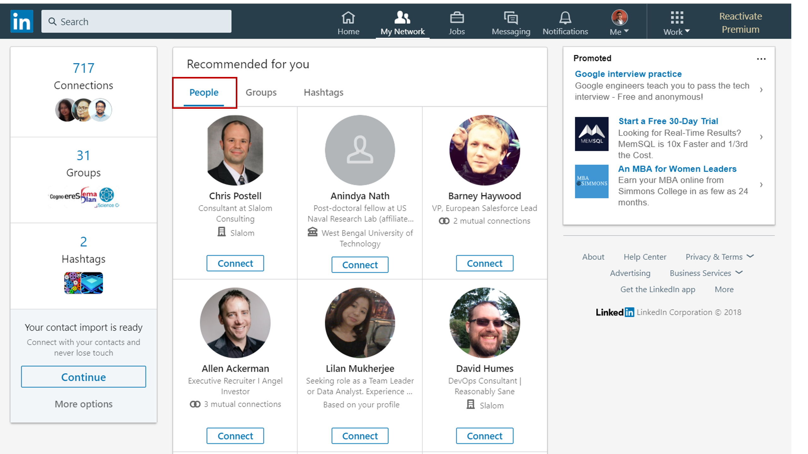
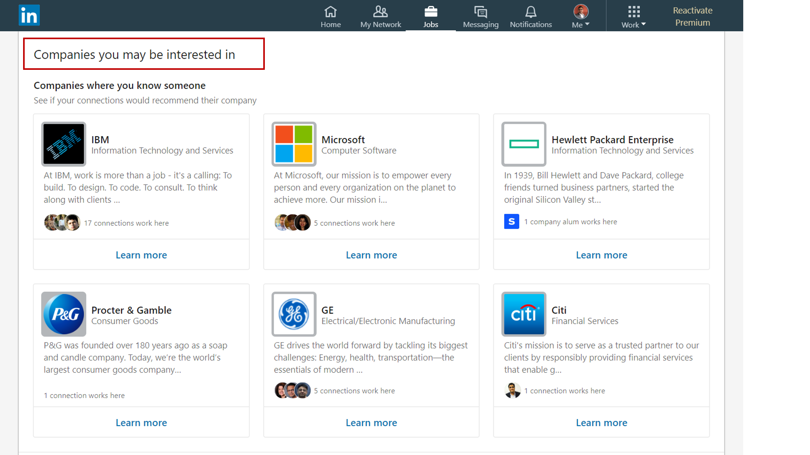
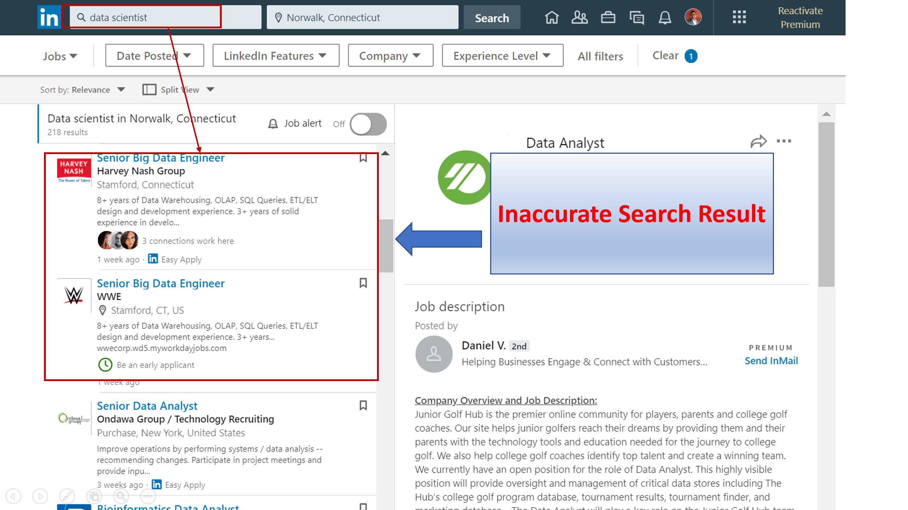

```{r setup, include=FALSE}
knitr::opts_chunk$set(echo = TRUE)
```


### Tasks for this Discussion-Assignment:

Identify an Existing Recommender System I find interesting.

  * Perform a Scenario Design analysis as described below. Consider whether it makes sense for your selected recommender system to perform scenario design twice, once for the organization (e.g. Amazon.com) and once for the organization's customers.
    
  * Attempt to reverse engineer what I can about the site, from the site interface and any available information that I can find on the Internet or elsewhere.

  * Include specific recommendations about how to improve the site's recommendation capabilities going forward.

  * Create a report using an R Markdown file, and create a discussion thread with a link to the GitHub repo where my Markdown file notebook resides.
  
### A. Recommender System :

LinkedIn makes extensive use of item-based collaborative filtering, which showcases relationships between pairs of items based on the wisdom of the crowd. As an example, each member's profile on LinkedIn has a "People Who Viewed This Profile Also Viewed" recommendation module. Known as a profile browsemap, this module is a navigational aid displaying other profiles that are frequently co-viewed together with the current profile. Similarly, job posting page has a job browsemap ("People Who Viewed This Job Also Viewed") that showcases related jobs discovered by other people. In fact, collaborative filtering datasets, or browsemaps, exist for many entity types on LinkedIn such as member, job, company, and group. These navigational aids are principal components of engagement on the site.

### B. Scenario Design Analyses :

   * **Who are the target users?**
   
     Millions of Professionals, Job seekers, Recruiters etc.
    
   * **What are the their key goals?**
   
    LinkedIn users' key goals are -
       
       + Expand professional network
       
       + Find appropriate jobs
       
       + Recruit talents to fill open positions
    
   * **How can the application help them accomplish their goals?**
   
   LinkedIn application helps a wide variety of user types to accomplish their goals by providing customized user experience through their horizontal collaborative filtering infrastructure called **Browsemap**. This co-ocurrence based recommendation infrastructure is available for different types of entities like  members, companies, jobs etc. in the form of navigational aids. For example "Companies You May Want To Follow" is a member-to-company recommendation: suggesting companies based on matching member and company information. When a member has more detailed information such as work experience, education, and  location, LinkedIn can provide better service to him/her with a richer user experience and more personalized recommendations on the website. To make it easier for a member updating her profile, LinkedIn predicts certain attributes that he/she has not yet included, such as company and location. The prediction is shown to the member, and upon approval, the information is saved to his/her member profile. Helping recruiters and hiring managers find highly qualified candidates is an important service LinkedIn provides using a service called "Similar Profiles" which enables hiring professionals to discover similarly qualified candidates on LinkedIn.
   
### C. Reverse Engineering Site :

It is a very difficlut job to reverse engineer World's largent and most popular professional networking site. But based on my research, I have come up with following two scenarios -

1.  Network Connection Recommendation for a member:

When a member logs into LinkedIn site and looks for expanding his/her professional network, the site lists a set of other member profiles as a potential connection opportunity as depicted below.  Based on  y research, I believe the algorithm for "Similar Profiles" follows the design pattern involving a set of (source member, target member) tuples, where the "source member" is the member who needs recommendation, and the "target member" is the potential recommended member. A propensity score is calculated for each tuple. Target members with high propensity scores are returned as the recommendation for the source member as possible netwrok expansion.



2.  Company recommendations :

Under jobs section, LinkedIn provides a list of companies that a member may want to follow for future job opportunities. "Companies You May Be Interested In" has two types of features for members: collaborative filtering features extracted from the company-follow browsemaps, and the content-based features extracted from the member profile. The algorithm calculates the similarity scores from the matching features of member and company entities, and computes an overall propensity score from the individual scores.



### D. Specific Recommendations to Improve Site's Recommendation Capabilities moving Forward:

I believe there are definitely some opportunities of improvement for LinkedIn's recommender system when it comes to search based techniques. I observed in the below depicted situation where I searched for a job for 'Data Scientist' and the search result returned Data engineer roles -



Also, I have personally tried LinkedIn's premium paid membership and found that lot of the visibility and recommendation features that they promise for premium subscription are not actually fulfilled based on my personal experience. 

### References :

https://engineering.linkedin.com/recommender-systems/browsemap-collaborative-filtering-linkedin

http://ls13-www.cs.tu-dortmund.de/homepage/rsweb2014/papers/rsweb2014_submission_3.pdf

