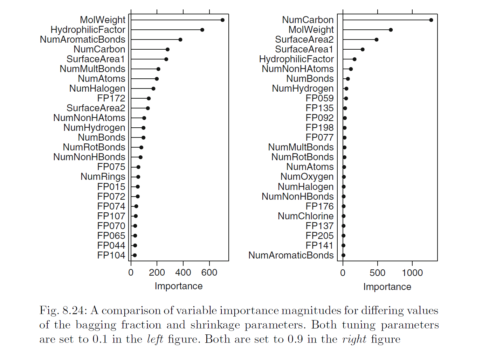

```{r setup, include=FALSE}
knitr::opts_chunk$set(echo = TRUE)
```

## Libraries

```{r warning=FALSE, message=FALSE}
library(kableExtra)
library(tidyverse)
library(ggplot2)
library(dplyr)
library(TSstudio)
library(RColorBrewer)
library(GGally)
library(grid)
library(gridExtra)
library(mlbench)
library(psych)
library(cowplot)
library(corrplot)
library(caret)
library(geoR)
library(reshape)
library(naniar)
library(mice)
library(DMwR)
library(AppliedPredictiveModeling)
library(pls)
library(glmnet)
library(elasticnet)
library(earth)
library(kernlab)
library(randomForest)
library(vip)
library(party)
library(Cubist)
library(gbm)
library(rpart.plot)
```

## Applied Predictive Modeling

### Exercise 8.1

Recreate the simulated data from Exercise 7.2:

```{r}
set.seed(200)

simulated <- mlbench.friedman1(200, sd = 1)
simulated <- cbind(simulated$x, simulated$y)
simulated <- as.data.frame(simulated)
colnames(simulated)[ncol(simulated)] <- "y"
```

(a) Fit a random forest model to all of the predictors, then estimate the variable importance scores:

```{r}
model1 <- randomForest(y ~ ., data = simulated,
                        importance = TRUE,
                        ntree = 1000)


rfImp1 <- varImp(model1, scale = FALSE)

rfImp1

varImpPlot(model1, scale = FALSE)

rfImp1 <- model1$importance 
vip(model1, color = 'red', fill='orange') + 
  ggtitle('Random Forest Model Variable Importance')


```

Did the random forest model significantly use the uninformative predictors (V6 – V10)?

No it did not. The predictors V6 ~ V10 have very little importance, compared to other predictors such as V1, V2, V4, and V5.


(b) Now add an additional predictor that is highly correlated with one of the informative predictors. For example:

```{r}
simulated$duplicate1 <- simulated$V1 + rnorm(200) * .1
cor(simulated$duplicate1, simulated$V1)
```

Fit another random forest model to these data. Did the importance score for V1 change? 

```{r}
model2 <- randomForest(y ~ ., data = simulated, importance = TRUE, ntree = 1000)
rfImp2 <- varImp(model2, scale = FALSE)
rfImp2

grid.arrange(vip(model1, color = 'red', fill='dodgerblue4') + 
  ggtitle('Model1 Var Imp'), vip(model2, color = 'green', fill='red') + 
  ggtitle('Model2 Var Imp'), ncol = 2)
```

When we add one predictor that is highly correlated with V1, the importance score for V1 decreases. V4 is now the most important predictor.

What happens when you add another predictor that is also highly correlated with V1?

```{r}
simulated$duplicate2 <- simulated$V1 + rnorm(200) * .2
model3 <- randomForest(y ~ ., data = simulated, importance = TRUE, ntree = 1000)
rfImp3 <- varImp(model3, scale = FALSE)
rfImp3

```

When we add yet another predictor that is also highly correlated with V1, the importance of V1 in our model decreases once more.

(c) Use the **cforest()** function in the **party** package to fit a random forest model using conditional inference trees. The party package function **varimp()** can calculate predictor importance. The conditional argument of that function toggles between the traditional importance measure and the modified version described in Strobl et al. (2007). Do these importances show the same pattern as the traditional random forest model?

```{r}
cmodel1 <- cforest(y ~ ., data = simulated)
varimp(cmodel1, conditional = TRUE)
```

The importances using conditional inference trees seem to show the same pattern in the predictors that are chosen by the model. V6-V10 are still less importance, but we do see that V3 has become less important relative to the results of the traditional random forest model.

(d) Repeat this process with different tree models, such as boosted trees and Cubist. Does the same pattern occur?

#### Cubist Model

```{r}
model4 <- cubist(x = simulated[, names(simulated)[names(simulated) != 'y']], 
                 y = simulated[,c('y')])


# Conditional variable importance
cfImp4 <- varImp(model4, conditional = TRUE)
cfImp4
# Un-conditional variable importance
cfImp5 <- varImp(model4, conditional = FALSE)
cfImp5

old.par <- par(mfrow=c(1, 2))
barplot((t(cfImp4)),horiz = TRUE, main = 'Conditional', col = rainbow(3))
barplot((t(cfImp5)),horiz = TRUE, main = 'Un-Conditional', col = rainbow(5))
```

#### Boosted Trees

```{r}
gbmGrid = expand.grid(interaction.depth = seq(1,5, by=2), n.trees = seq(100, 1000, by = 100), shrinkage = 0.1, n.minobsinnode = 5)
model4 <- train(y ~ ., data = simulated, tuneGrid = gbmGrid, verbose = FALSE, method = 'gbm' )


# Conditional variable importance
cfImp4 <- varImp(model4, conditional = TRUE)
cfImp4
# Un-conditional variable importance
cfImp5 <- varImp(model4, conditional = FALSE)
cfImp5

old.par <- par(mfrow=c(1, 2))
barplot((t(cfImp4$importance)),horiz = TRUE, main = 'Conditional', col = rainbow(3))
barplot((t(cfImp5$importance)),horiz = TRUE, main = 'Un-Conditional', col = rainbow(5))
```

We can see that conditional and un-conditional variable importance is same for Cubist and Boosted Trees algorithms.

### Exercise 8.2

Use a simulation to show tree bias with different granularities.

Let’s create a simulated dataset there output variable Y is combination of two input variable V1 and V2. V1 has high number distinct values (2-500) compared to V2 (2-10).

```{r warning=FALSE, message=FALSE}
V1 <- runif(1000, 2,500)
V2 <- rnorm(1000, 2,10)
V3 <- rnorm(1000, 1,1000)
y <- V2 + V1 

df <- data.frame(V1, V2, V3, y)
model3 <- cforest(y ~ ., data = df)

cfImp4 <- varimp(model3, conditional = FALSE)
barplot(sort(cfImp4),horiz = TRUE, main = 'Un-Conditional', col = rainbow(5))

```

We can see that Random Forest algorithm gives high score to variable V1 which has more number of distinct values.

Let’s reverse the granularity of V1 and V2 variable respectively. Output variable y will remain unchanged. Let’s fit the Random Forest tree and observe the variable importance.

```{r warning=FALSE, message=FALSE}
V1 <- runif(1000, 2,10)
V2 <- rnorm(1000, 2,500)
V3 <- rnorm(1000, 1,1000)
y <- V2 + V1 
 

df <- data.frame(V1, V2, V3, y)
model3 <- cforest(y ~ ., data = df)

cfImp4 <- varimp(model3, conditional = FALSE)
barplot(sort(cfImp4),horiz = TRUE, main = 'Un-Conditional', col = rainbow(5))
```

We can see that Random forest algorithm now gives high score to V2 variable since it is more granular (high number of distinct values 2-500).

### Exercise 8.3

In stochastic gradient boosting the bagging fraction and learning rate will govern the construction of the trees as they are guided by the gradient. Although the optimal values of these parameters should be obtained
through the tuning process, it is helpful to understand how the magnitudes of these parameters affect magnitudes of variable importance. Figure 8.24 provides the variable importance plots for boosting using two extreme values for the bagging fraction (0.1 and 0.9) and the learning rate (0.1 and 0.9) for the solubility data. The left-hand plot has both parameters set to 0.1, and the right-hand plot has both set to 0.9:



(a) Why does the model on the right focus its importance on just the first few of predictors, whereas the model on the left spreads importance across more predictors?

Model on right have high bagging fraction rate (0.9). This means more and more trees saw the same fraction of data and diversity in variable selction is reduced. It results in few predictors dominating the importance score compared to left model which has very granular bagging fraction (0.1).

(b) Which model do you think would be more predictive of other samples?

Model with lower learning rate and bagging fraction should be more predictive on other sample. It has a balanced mix of selected important predictors rather than veyr few predictors with very high importance in the right hand side model. Right hand side model cna be over bias to the training data and can fail to generalize on test data due to its stong fiting on training dataset.

(c) How would increasing interaction depth affect the slope of predictor importance for either model in Fig. 8.24? 

As we increase the interaction depth, trees are allowed to grow more deep. This will result in more and more predictors to consider for tree splitting chioce. This will spread the variable importance to more variables rather than selecting very few predictors with very high importance.

### Exercise 8.7

Refer to Exercises 6.3 and 7.5 which describe a chemical manufacturing process. Use the same data imputation, data splitting, and pre-processing steps as before and train several tree-based models:

#### Data set Preview

```{r}
data(ChemicalManufacturingProcess)

ChemicalManufacturingProcess %>% kable() %>% kable_styling(bootstrap_options = c("striped", "hover", "condensed", "responsive")) %>% 
  scroll_box(width="100%",height="300px")
```

#### Imputation Process: K Nearest Neighbor Technique

I have adopted the KNN approach for imputation for the current data set using the **knnImputation()** fruntion from **DMwR** package. I am using k=10 as a tuning parameter.

```{r}
ChemicalManProcessImputed <- knnImputation(ChemicalManufacturingProcess, k = 10)
```

#### Pre-Processing

##### Excluding Near Zero Variance Predictors

```{r}
nZVIndices <- nearZeroVar(ChemicalManProcessImputed)

ChemicalManProcessTransformed <- ChemicalManProcessImputed[,-nZVIndices]
```

##### Excluding highly Correlated Predictors

```{r}
corThresh <- 0.9
tooHigh <- findCorrelation(cor(ChemicalManProcessTransformed), corThresh)
corrPred <- names(ChemicalManProcessTransformed)[tooHigh]
ChemicalManProcessTransformed <- ChemicalManProcessTransformed[,-tooHigh]
```

#### Test/Train Split

```{r}
trainingRows <- createDataPartition(ChemicalManProcessTransformed$Yield, times = 1, p = 0.8, list = FALSE)

train_df <- ChemicalManProcessTransformed[trainingRows,]
test_df <- ChemicalManProcessTransformed[-trainingRows,]

df.train.x = train_df[,-1]
df.train.y = train_df[,1]
df.test.x = test_df[,-1]
df.test.y = test_df[,1]
```

#### Model Evaluation Function

```{r}
model.eval = function(modelmethod, gridSearch = NULL)
{
  Model = train(x = df.train.x, y = df.train.y, method = modelmethod, tuneGrid = gridSearch, preProcess = c('center', 'scale'), trControl = trainControl(method='cv'))
  Pred = predict(Model, newdata = df.test.x)
  modelperf = postResample(Pred, df.test.y)
  print(modelperf)
}
```

(a) Which tree-based regression model gives the optimal resampling and test set performance?

#### Model1: Simple Regression Tree

```{r}
perftree = model.eval('rpart')
```

#### Model2: Random Forest

```{r}
perfrf = model.eval('rf')
```

#### Model3: Gradient Boosting Tree

```{r}
perfgbm = model.eval('gbm')

```

#### Model4: Cubist

```{r}
perfcubist = model.eval('cubist')
```

#### Model Comparison

```{r}
df.perf = rbind(data.frame(Name = 'SimpleRegressionTree', RMSE = round(perftree[1],4)), 
                data.frame(Name= 'RandomForest', RMSE = round(perfrf[1],4)), 
                data.frame(Name = 'BoostingTree', RMSE = round(perfgbm[1],4)), 
                data.frame(Name = 'Cubist', RMSE = round(perfcubist[1],4)))

ggplot(data = df.perf, aes(x = Name, y = RMSE, fill=Name)) +
  geom_bar(stat="identity", position=position_dodge()) +
  geom_text(aes(label=RMSE), vjust=1, color="white",
            position = position_dodge(0.9), size=3.5)
```

From the above model performance chart, we can see the Cubist model gives the lowest RMSE on test set. Cubist is the most optimal model for this dataset.

(b) Which predictors are most important in the optimal tree-based regression model? Do either the biological or process variables dominate the list? How do the top 10 important predictors compare to the top 10 predictors from the optimal linear and nonlinear models?

```{r}
cModel <- train(x = df.train.x,
                     y = df.train.y,
                     method = 'cubist')
vip(cModel, color = 'red', fill='dodgerblue4')
```

We can see that manufacturing process variables dominate the list of important variables which is in parity with optimal list of variables from linear and non-linear models.

(c) Plot the optimal single tree with the distribution of yield in the terminal nodes. Does this view of the data provide additional knowledge about the biological or process predictors and their relationship with yield?

```{r}
multi.class.model  = rpart(Yield~., data=train_df)
rpart.plot(multi.class.model)
```

From the above tree plot, we can clearly see that high values of manufacturing process vairaibles contributes to higher Yield.

